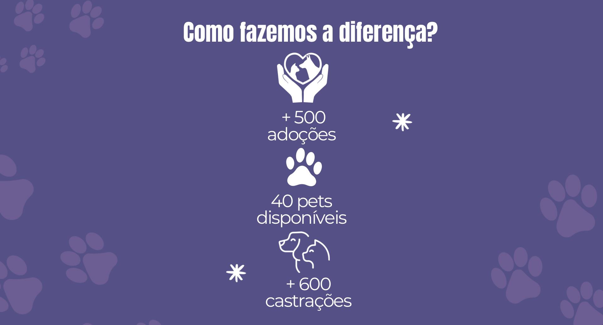

<!-- Improved compatibility of back to top link: See: https://github.com/othneildrew/Best-README-Template/pull/73 -->

<a id="readme-top"></a>

<!-- PROJECT LOGO -->
<br />
<div align="center">
  <a href="./">
    
  </a>

  <h3 align="center">ACAPRA</h3>

  <p align="center">
    Site informativo da ACAPRA para promover a adoção responsável e combater os maus-tratos aos animais.
    <br />
    <a href="./"><strong>Explorar o projeto »</strong></a>
    <br />
    <br />
    <a href="https://acapra-projeto-v1.netlify.app/">Acessar Demo</a>
    &middot;
    <a href="issues/new?labels=bug&template=bug-report---.md">Reportar bug</a>
    &middot;
    <a href="issues/new?labels=enhancement&template=feature-request---.md">Sugerir melhoria</a>
  </p>
</div>

<!-- TABLE OF CONTENTS -->
<details>
  <summary>Sumário</summary>
  <ol>
    <li>
      <a href="#sobre-o-projeto">Sobre o projeto</a>
      <ul>
        <li><a href="#construido-com">Construído com</a></li>
      </ul>
    </li>
    <li>
      <a href="#primeiros-passos">Primeiros passos</a>
      <ul>
        <li><a href="#pre-requisitos">Pré-requisitos</a></li>
        <li><a href="#instalacao">Instalação</a></li>
      </ul>
    </li>
    <li><a href="#uso">Uso</a></li>
    <li><a href="#contribuindo">Contribuindo</a></li>
    <li><a href="#licenca">Licença</a></li>
    <li><a href="#contato">Contato</a></li>
    <li><a href="#agradecimentos">Agradecimentos</a></li>
  </ol>
</details>

<!-- ABOUT THE PROJECT -->

## Sobre o projeto

[](https://acapra-projeto-v1.netlify.app/)

O site da ACAPRA divulga animais disponíveis para adoção, apresenta nossa missão, orienta como ajudar e como denunciar maus-tratos. É um site estático simples, focado em acessibilidade e informação clara para a comunidade.

Páginas principais:
- `index.html` (Missão)
- `adotar.html` (Como adotar e listas de pets)
- `adotados.html` (Pets já adotados)
- `como-ajudar.html` (Formas de apoiar)
- `maus-tratos.html` (Como denunciar)

<p align="right">(<a href="#readme-top">voltar ao topo</a>)</p>

### Construído com

- [![Next][Next.js]][Next-url]
- [![React][React.js]][React-url]
- [![Vue][Vue.js]][Vue-url]
- [![Angular][Angular.io]][Angular-url]
- [![Svelte][Svelte.dev]][Svelte-url]
- [![Laravel][Laravel.com]][Laravel-url]
- [![Bootstrap][Bootstrap.com]][Bootstrap-url]
- [![JQuery][JQuery.com]][JQuery-url]

<p align="right">(<a href="#readme-top">voltar ao topo</a>)</p>

<!-- GETTING STARTED -->

## Primeiros passos

Estas instruções ajudam você a rodar o projeto localmente para desenvolvimento e testes.

### Pré-requisitos

- Navegador moderno (Chrome, Firefox, Edge ou Safari)
- Opcional: extensão/servidor local para "Live Reload" (ex.: VS Code Live Server)

### Instalação

1. Clone o repositório
   ```sh
   git clone https://github.com/<seu-usuario>/ACAPRA.git
   ```
2. Abra a pasta do projeto no seu editor
3. Abra o arquivo `index.html` diretamente no navegador
   - Opcional: sirva via um servidor local para melhor experiência
4. Para visualização online, acesse: `https://acapra-projeto-v1.netlify.app/`

<p align="right">(<a href="#readme-top">voltar ao topo</a>)</p>

<!-- USAGE EXAMPLES -->

## Uso

- Navegue pelo menu superior para conhecer a missão, ver pets disponíveis, conferir adoções concluídas, saber como ajudar e como denunciar maus-tratos.
- As imagens em `assets/images/` são utilizadas nas seções de destaque e galerias.

<p align="right">(<a href="#readme-top">voltar ao topo</a>)</p>

<!-- CONTRIBUTING -->

## Contribuindo

Contribuições tornam a comunidade open source um lugar incrível para aprender, inspirar e criar. Qualquer contribuição é **muito bem-vinda**.

1. Faça um Fork do projeto
2. Crie uma Branch de Feature (`git checkout -b feature/SuaFeature`)
3. Faça Commit das mudanças (`git commit -m 'feat: adiciona SuaFeature'`)
4. Faça Push para a Branch (`git push origin feature/SuaFeature`)
5. Abra um Pull Request

<p align="right">(<a href="#readme-top">voltar ao topo</a>)</p>

<!-- LICENSE -->

## Licença

Ainda não há uma licença pública definida para este repositório. Considere adicionar um arquivo `LICENSE.txt`.

<p align="right">(<a href="#readme-top">voltar ao topo</a>)</p>

<!-- CONTACT -->

## Contato

Time (ordem alfabética): Ariel Bento, Brendon Teske, Guilherme Keller De Souza, Igor Henrique, Nicoly Bourdot, Wander Souza

Redes ACAPRA: Instagram — `https://www.instagram.com/acaprabrusquesc/`

Projeto online: `https://acapra-projeto-v1.netlify.app/`

<p align="right">(<a href="#readme-top">voltar ao topo</a>)</p>

<!-- ACKNOWLEDGMENTS -->

## Agradecimentos

- ACAPRA – Associação Brusquense de Proteção aos Animais
- Netlify pela hospedagem
- Comunidade open source

<p align="right">(<a href="#readme-top">voltar ao topo</a>)</p>

<!-- MARKDOWN LINKS & IMAGENS -->
<!-- https://www.markdownguide.org/basic-syntax/#reference-style-links -->

[Next.js]: https://img.shields.io/badge/next.js-000000?style=for-the-badge&logo=nextdotjs&logoColor=white
[Next-url]: https://nextjs.org/
[React.js]: https://img.shields.io/badge/React-20232A?style=for-the-badge&logo=react&logoColor=61DAFB
[React-url]: https://reactjs.org/
[Vue.js]: https://img.shields.io/badge/Vue.js-35495E?style=for-the-badge&logo=vuedotjs&logoColor=4FC08D
[Vue-url]: https://vuejs.org/
[Angular.io]: https://img.shields.io/badge/Angular-DD0031?style=for-the-badge&logo=angular&logoColor=white
[Angular-url]: https://angular.io/
[Svelte.dev]: https://img.shields.io/badge/Svelte-4A4A55?style=for-the-badge&logo=svelte&logoColor=FF3E00
[Svelte-url]: https://svelte.dev/
[Laravel.com]: https://img.shields.io/badge/Laravel-FF2D20?style=for-the-badge&logo=laravel&logoColor=white
[Laravel-url]: https://laravel.com
[Bootstrap.com]: https://img.shields.io/badge/Bootstrap-563D7C?style=for-the-badge&logo=bootstrap&logoColor=white
[Bootstrap-url]: https://getbootstrap.com
[JQuery.com]: https://img.shields.io/badge/jQuery-0769AD?style=for-the-badge&logo=jquery&logoColor=white
[JQuery-url]: https://jquery.com
